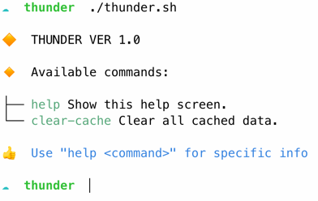

# Cloudy

> A BASH Framework for PHP-Minded Developers


## Summary

* Clean and simple YAML configuration
* Easy integration with PHP
* BASH Unit Testing framework inspired by [PHPUnit](https://phpunit.de)
* Auto-generated help output
* Support for multilingual localization

**Visit <https://aklump.github.io/cloudy> for full documentation.**

## Quick Start

Let's consider a project called _Thunder_:

1. Create a new directory to hold your project, e.g. _thunder/_
2. Change into that directory.
3. Install Cloudy using one of the methods described below.
4. Copy and rename scaffold files:
   ```shell
   cp cloudy/install/__package_name.sh thunder.sh
   cp cloudy/install/__package_name.yml thunder.yml
   ```
5. Open _thunder.sh_ and _thunder.yml_
7. Replace `__package_name` with an appropriate value.
8. Execute your script using `./thunder.sh` to ensure things are working.

   

9. Now write code referring to [the documentation](https://aklump.github.io/cloudy/README.html) for guidance.
1. Also refer to _cloudy/examples/_ for more code examples.

## Install with Composer

1. Because this is an unpublished package, you must define it's repository in
   your project's _composer.json_ file. Add the following to _composer.json_ in
   the `repositories` array:
   
    ```json
    {
        "type": "github",
        "url": "https://github.com/aklump/cloudy"
    }
    ```
1. Require this package:
   
    ```
    composer require aklump/cloudy:^2.0
    ```

## Install with Composer Create Project

Use this method to create a _cloudy/_ folder in the root of your project.

1. Change to the root of your project and execute:
   ```shell
   composer create-project aklump/cloudy:^2.0 --repository="{\"type\":\"github\",\"url\": \"https://github.com/aklump/cloudy\"}"
   ```   
2. Replace the _.gitignore file_:
    ```bash
    rm cloudy/.gitignore
    cp cloudy/install/composer_create_project/gitignore cloudy/.gitignore
    ```

## Requirements

* BASH >=3
* PHP
* Composer

## Contributing

If you find this project useful... please consider [making a donation](https://www.paypal.com/cgi-bin/webscr?cmd=_s-xclick&hosted_button_id=4E5KZHDQCEUV8&item_name=Gratitude%20for%20aklump%2Fcloudy).

## Learn More

* Learn more about BASH with the [Advanced Bash-Scripting Guide](https://www.tldp.org/LDP/abs/html/).
* Checkout [The Bash Guide](https://guide.bash.academy/) by Maarten Billemont.
